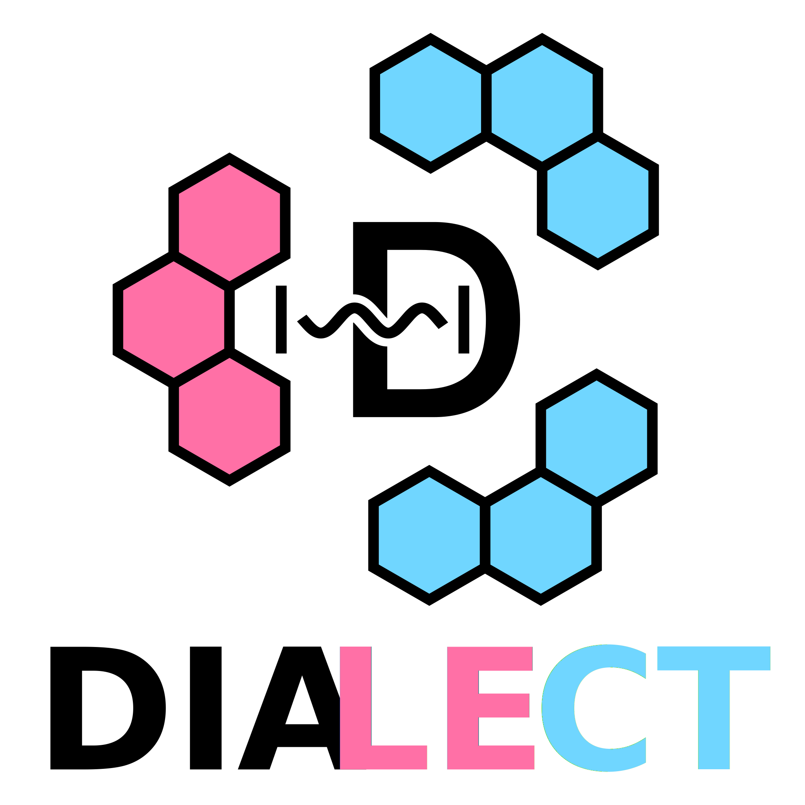

# DIALECT

The __DIALECT__(**DIA**batic **L**ocally **E**xcited and **C**harge-**T**ransfer states) software was designed to calculate the excited state properties and exciton dynamics of large molecular systems, including strong light-matter interactions between microcavities and molecular assemblies. It is developed in the group of Prof. Dr. Roland Mitrić at the University of Würzburg.

# Documentation
A short guide, which explains the installation and use of our program is available [here](https://github.com/dialect-rs/manual).  

# Citation
Richard Einsele, Joscha Hoche and Roland Mitrić, Long-range corrected fragment molecular orbital density functional tight-binding method for excited states in large molecular systems, *J. Chem. Phys.*, __2023__, 158, 044121, https://doi.org/10.1063/5.0136844

Richard Einsele and Roland Mitrić, Nonadiabatic Exciton Dynamics and Energy Gradients in the Framework of FMO-LC-TDDFTB, *J. Chem. Theory Comput.*, __2024__, 20(15), 6587-6603, https://pubs.acs.org/doi/abs/10.1021/acs.jctc.4c00539

Richard Einsele, Luca Nils Philipp and Roland Mitrić, FMO-LC-TDDFTB method for excited states of large molecular assemblies in the strong light-matter coupling regime, *J. Chem. Phys.*, __2024__, 161, 154106, https://doi.org/10.1063/5.0231191

# License
__DIALECT__ is released under the GNU Lesser General Public License. For more information, see the included [LICENSE](https://github.com/dialect-rs/DIALECT-rs/blob/main/LICENSE) file.
